# PRSA 北京多站点空气质量预测实验报告（v2.1）

## 摘要

本报告基于 UCI PRSA Beijing Multi‑Site Air Quality 数据集（2013–2017），完整记录了一个端到端的空气质量预测系统，包括：
1. 探索性数据分析（EDA）
2. 防数据泄露的预处理流程（v2.1）
3. 七个基线模型（B0–B6）的训练与评估
4. 自定义模型 **WG‑DGTM**（Wind‑Gated Dynamic Graph + TCN）的设计思路、实现细节与实验结果

**核心任务**：利用过去 7 天（168 小时）的多站点观测数据，预测未来 24 小时内北京 12 个监测站的 6 种污染物浓度。所有评估指标都在测试集上计算，并严格使用 `Y_mask` 屏蔽缺失值（masked metrics）。

**主要成果**：在当前实验中，WG‑DGTM 的 macro_MAE（各污染物等权平均）达到 **179.533**，优于最佳基线模型 LightGBM 的 **182.237**；并且在全部 6 种污染物上都超过了各自的最优基线。详细结果见第 7 节。

---

## 1. 数据集与任务定义

### 1.1 数据来源与基本信息

数据集存放在 `PRSA_Data_20130301-20170228/` 目录下,包含北京 12 个监测站的空气质量数据。每个站点有一个 CSV 文件,记录了 35,064 条小时级别的观测数据,总计 420,768 行。数据时间跨度为 **2013 年 3 月 1 日 00:00** 至 **2017 年 2 月 28 日 23:00**,覆盖完整的 4 年。

完整的站点列表和数据结构可查看 `eda_output/station_summary.csv`。

### 1.2 变量说明与单位

**预测目标**（6 种污染物,顺序固定为 `[PM2.5, PM10, SO2, NO2, CO, O3]`）：

| 变量 | 单位 | 说明 |
|---|---|---|
| PM2.5 | μg/m³ | 细颗粒物 |
| PM10 | μg/m³ | 可吸入颗粒物 |
| SO2 | μg/m³ | 二氧化硫 |
| NO2 | μg/m³ | 二氧化氮 |
| CO | μg/m³ | 一氧化碳（注意：数值量级远大于其他污染物,约为千位数） |
| O3 | μg/m³ | 臭氧 |

**输入特征**（气象与时间信息）：
- **气象变量**（5 个）：温度 TEMP（°C）、气压 PRES（hPa）、露点温度 DEWP（°C）、降水量 RAIN（mm）、风速 WSPM（m/s）
- **风向**：原始数据中为离散的方位角 `wd`,预处理时转换为连续的正弦/余弦编码 `wd_sin` 和 `wd_cos`
- **时间周期特征**：小时的正弦/余弦编码 `hour_sin/hour_cos` 和月份的正弦/余弦编码 `month_sin/month_cos`,共 4 个特征

### 1.3 任务参数设置

整个项目使用统一的任务参数配置（详见 `processed/metadata.json`）：

| 参数 | 说明 | 数值 |
|---|---|---:|
| `N` | 监测站点数量 | 12 |
| `L` | 历史观测窗口（回看长度） | 168 小时（7 天） |
| `H` | 预测时间跨度（预测步数） | 24 小时 |
| `D` | 预测污染物种类数 | 6 |
| `F` | 输入特征总维度 | 17 |

也就是说,我们用过去一周的数据来预测未来一天的污染物浓度。

---

## 2. 探索性数据分析（EDA）

探索性分析由 `eda_beijing_air_quality.py` 完成,所有结果保存在 `eda_output/` 目录下（包括详细的 HTML 报告 `eda_report.html` 以及各类图表和统计表）。

**主要输出文件**：
- **报告**：`eda_report.html` - 交互式HTML报告,包含完整分析结果
- **数据表**：
  - `station_summary.csv` - 站点文件清单和基本信息
  - `missingness_by_station_feature.csv` - 各站点各特征的缺失率详情
  - `stats_overall.csv` - 全局统计量（所有站点合并）
  - `stats_by_station.csv` - 分站点统计量
- **可视化**：
  - `missingness_analysis.png` - 缺失值分析热力图
  - `distributions_seasonality.png` - 分布与季节性快照（PM2.5、PM10、O3）
  - `pollutant_distributions.png` - **所有6种污染物的完整分布图**
  - `seasonality_all_pollutants.png` - **所有6种污染物的月周期和日周期完整分析**
  - `station_comparison.png` - **所有6种污染物在12个站点的箱线图**
  - `correlation_matrix.png` - 污染物与气象变量的相关性矩阵

这里总结对建模最重要的几个发现。

### 2.1 缺失值分析

从 `eda_output/missingness_by_station_feature.csv` 可以看到整体的缺失情况：
- **污染物数据**的缺失率明显高于气象数据,这可能是由于监测设备故障或校准导致的
- **气象数据**几乎完整,缺失率都在 0.1% 以下
- **风向数据** `wd` 有少量缺失,导致衍生的 `wd_sin` 和 `wd_cos` 也相应缺失

下表是所有站点合并后的缺失率统计（总共 12 个站点 × 35,064 小时 = 420,768 个数据点）：

| 特征 | 缺失率(%) |
|---|---:|
| CO | 4.92 |
| O3 | 3.16 |
| NO2 | 2.88 |
| SO2 | 2.14 |
| PM2.5 | 2.08 |
| PM10 | 1.53 |
| wd | 0.43 |
| TEMP | 0.09 |
| PRES | 0.09 |
| DEWP | 0.10 |
| RAIN | 0.09 |
| WSPM | 0.08 |

**缺失值分布热力图**（按站点和特征）：

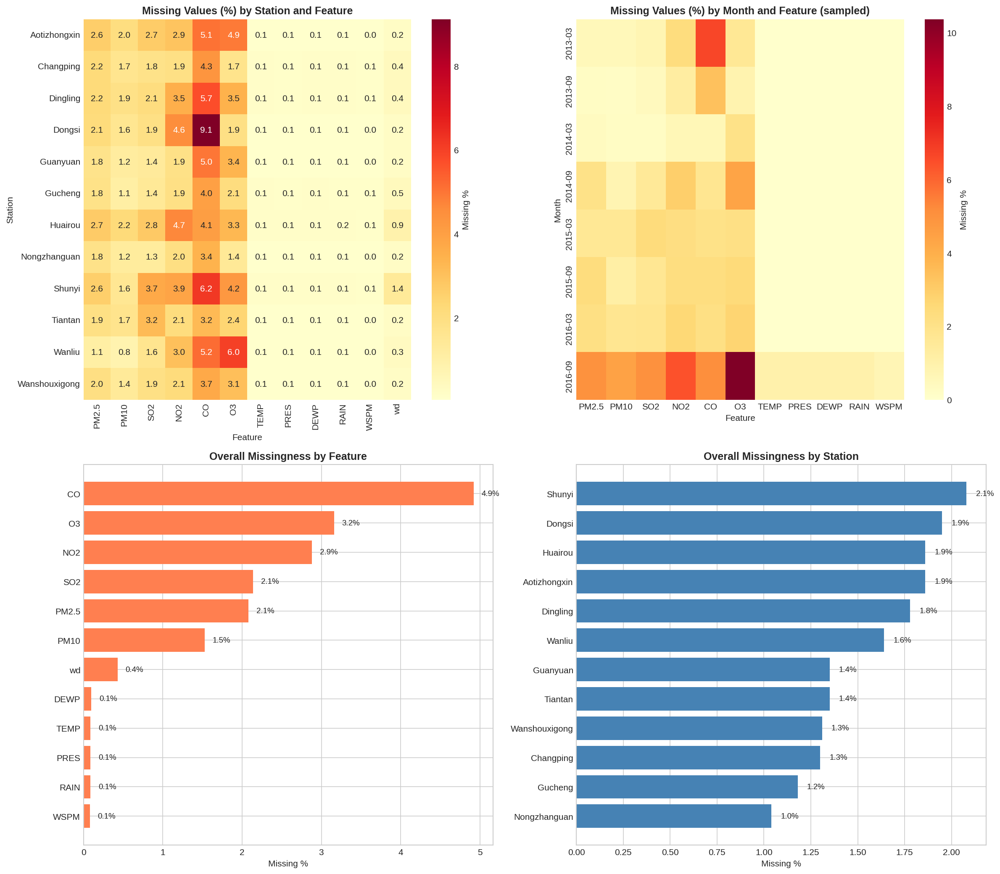

### 2.2 数据分布特征

从 `eda_output/stats_overall.csv` 可以看到各污染物的基本统计量（所有站点合并）。有几个值得注意的地方：

| 变量 | 均值 | 中位数 | 95分位数 | 最大值 |
|---|---:|---:|---:|---:|
| PM2.5 | 79.79 | 55 | 242 | 999 |
| PM10 | 104.60 | 82 | 279 | 999 |
| SO2 | 15.83 | 7 | 60 | 500 |
| NO2 | 50.64 | 43 | 117 | 290 |
| CO | 1230.77 | 900 | 3500 | 10000 |
| O3 | 57.37 | 45 | 177 | 1071 |

**关键观察**：
- 所有污染物都呈现**长尾分布**（均值明显大于中位数）
- **CO 的数值量级**是其他污染物的十倍以上（均值超过 1200 μg/m³,而其他污染物大多在几十到一百左右）,这对模型训练的损失函数设计提出了特殊要求
- 表中的极大值（PM2.5=999、PM10=999、CO=10000）其实是传感器的测量上限,预处理时会将这些异常值转为缺失值（详见第 3 节）

### 2.3 时间模式：季节性和日变化

北京的空气污染有非常明显的时间规律：
- **季节性**：冬季污染明显加重（供暖排放增加）,夏季相对较轻
- **日周期**：
  - PM2.5 通常在夜间和清晨浓度较高
  - O3 在下午达到峰值（阳光强度增加,光化学反应更活跃）

这种长周期（季节）和短周期（日内）叠加的模式,意味着模型需要能够捕捉多尺度的时间依赖关系。

**分布和季节性快照**（PM2.5、PM10、O3 代表性可视化）：

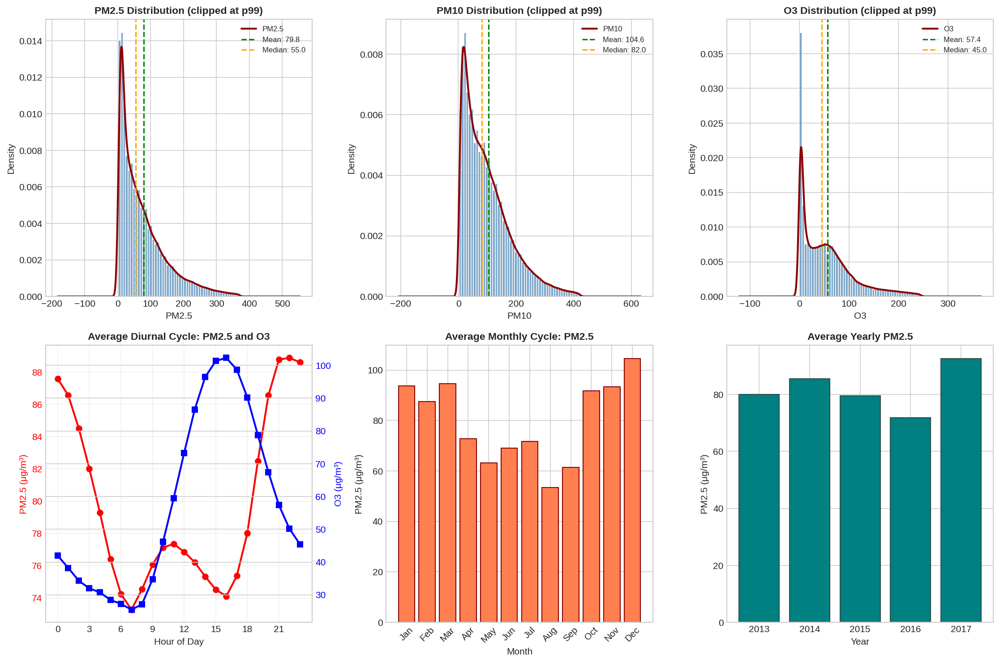

**所有污染物的完整季节性分析**（月周期与日周期）：

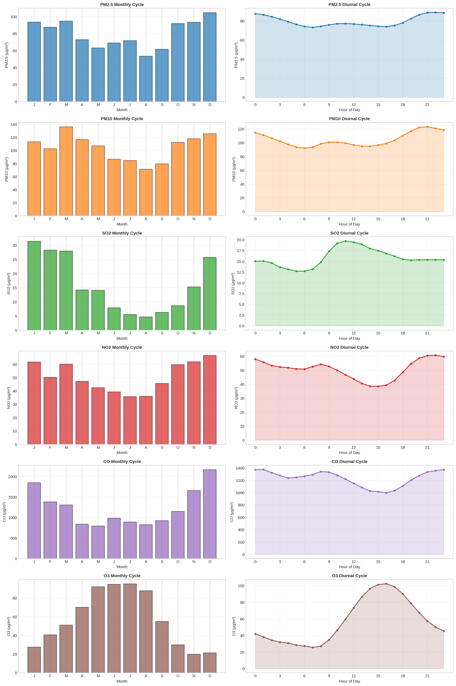

从完整的季节性分析图可以观察到每种污染物的独特时间模式：
- **PM2.5 和 PM10**：冬季（12-2月）浓度显著升高,日周期呈现夜间高、午后低的U型特征
- **SO2**：季节性模式与PM类似但幅度更大,冬季浓度可达夏季的3-4倍
- **NO2**：早晚交通高峰时段浓度上升,呈现明显的双峰日周期
- **CO**：季节性变化显著（冬高夏低）,日周期相对平缓
- **O3**：与其他污染物相反,夏季浓度更高,日周期呈现午后峰值（光化学反应）

**所有污染物的分布特征**（包含 PM2.5、PM10、SO2、NO2、CO、O3 六种污染物的完整分布图）：

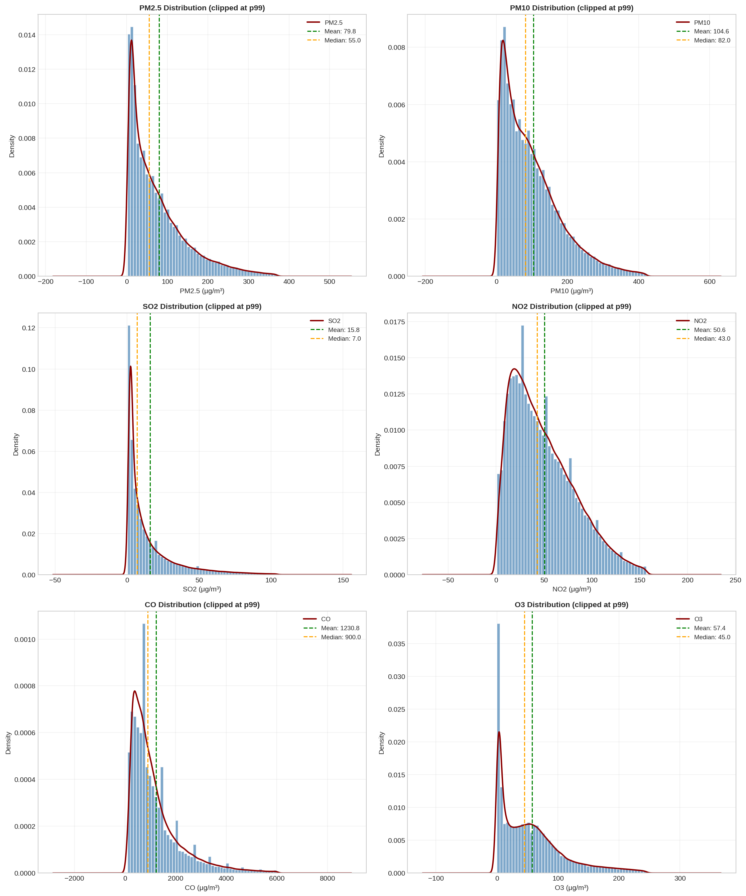

从完整的分布图可以看出：
- **PM2.5 和 PM10**：分布形态相似,均呈现右偏分布,大部分时间浓度较低,但偶尔会出现高污染事件
- **SO2 和 NO2**：也呈现右偏分布,但 SO2 的偏度更大（低值更集中）
- **CO**：虽然数值量级最大,但分布形态与其他污染物类似
- **O3**：相对而言分布更对称,峰值位置更明显

### 2.4 站点间的差异和关联

**站点异质性**：不同站点的污染水平差异明显。比如从 `eda_output/stats_by_station.csv` 可以看到：
- PM2.5 均值：Dingling 最低（65.99 μg/m³）,Dongsi 最高（86.19 μg/m³）
- CO 均值：Dingling 最低（904.90 μg/m³）,Wanshouxigong 最高（1370.40 μg/m³）

这说明建模时既要考虑各站点的独特性,也要捕捉站点之间的相互影响。

**站点对比图**（包含所有6种污染物在12个站点的分布箱线图）：

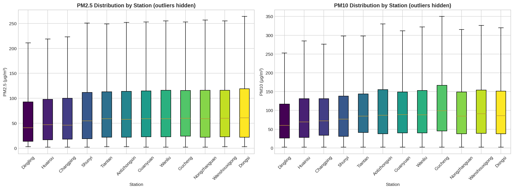

从站点对比图可以观察到：
- **空间异质性**：不同站点的污染物浓度中位数和分布范围存在明显差异
- **一致性模式**：虽然绝对水平不同,但大部分站点在各污染物上的变化趋势相似
- **极端值**：部分站点在特定污染物上偶尔会出现极高值（图中未显示以保持可读性）

**站点相关性**（以 PM2.5 为例）：

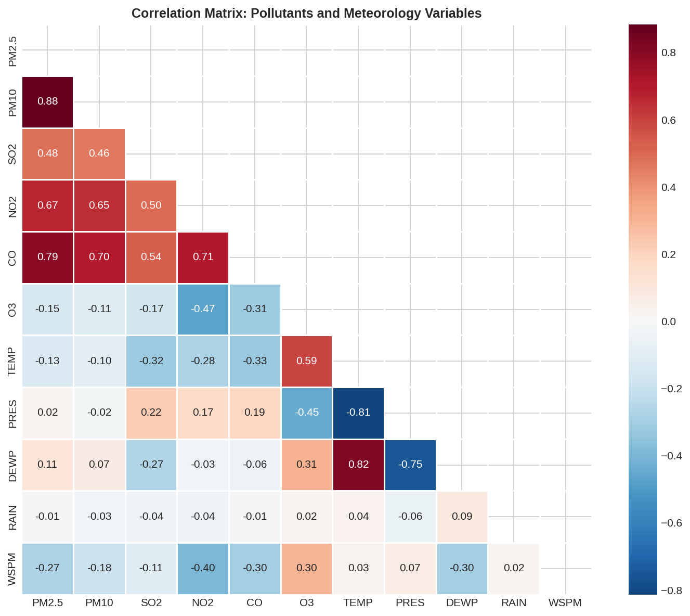

从相关矩阵可以看出,站点之间的 PM2.5 浓度有较强的正相关,这为使用图神经网络等方法提供了依据。

---

## 3. 数据预处理流程（v2.1）

预处理是整个系统的关键环节,实现在 `preprocessing_pipeline_v2.1.py` 中。所有处理后的数据保存在 `processed/` 目录,详细的处理日志在 `processed/reports/preprocessing_log.txt`,设计说明见 `processed/README.md`。

### 3.1 核心设计原则：严格防止数据泄露

在时间序列预测中,"数据泄露"是一个非常容易犯的错误——不小心使用了未来的信息。我们的预处理流程严格遵循以下原则：

1. **先划分、后处理**（Split-first）：首先按时间划分训练集/验证集/测试集,然后再做任何插补、归一化、图构建等操作。这样可以确保验证集和测试集绝对看不到训练集之外的信息。

2. **只用训练集的统计量**：所有需要拟合的参数（比如缺失值插补的中位数、RobustScaler 的缩放参数）都只从训练集计算,然后应用到所有数据集。

3. **图结构也只用训练集**：站点之间的相关性图（邻接矩阵）也只基于训练集的数据构建。

4. **窗口不跨越边界**：生成训练样本时,严格保证每个窗口只使用对应数据集内的数据,不会跨越训练/验证/测试的时间边界。

### 3.2 详细处理步骤

下面按照流水线的执行顺序,逐步说明每个处理环节（所有数值都可以从日志 `processed/reports/preprocessing_log.txt` 中核对）：

**步骤 1：加载原始数据**
- 读取 12 个站点的 CSV 文件,每个站点 35,064 条小时级记录,总计 420,768 行
- 站点按字母顺序排列,这个顺序在整个系统中保持一致（见 `processed/metadata.json` 中的 `station_list`）

**步骤 2：处理传感器上限值**
传感器测量有上限,当污染物浓度超过测量范围时会记录为固定的上限值（比如 PM2.5=999、PM10=999、CO=10000）。这些值不能直接参与计算,需要转换为缺失值（`NaN`）。

本次数据中识别出 61 个上限值（详见 `processed/reports/cap_values_report.csv`）：

| 站点 | 污染物 | 上限值 | 数量 |
|---|---|---:|---:|
| Wanshouxigong | PM2.5 | 999 | 1 |
| Changping / Guanyuan / Shunyi | PM10 | 999 | 各1,共3 |
| 多个站点 | CO | 10000 | 合计 57 |

**步骤 3：特征工程**
构建 17 维输入特征（完整列表见 `processed/feature_list.json`）：
- **风向编码**：原始的离散风向 `wd` 转换为角度,再计算正弦和余弦（`wd_sin` 和 `wd_cos`）。这样可以保持方向的连续性,比如北偏西 359° 和北偏东 1° 在数值上是相近的。
- **时间周期编码**：
  - 小时：`hour_sin = sin(2π × hour/24)`, `hour_cos = cos(2π × hour/24)`
  - 月份：`month_sin = sin(2π × month/12)`, `month_cos = cos(2π × month/12)`

  这种编码方式可以让模型理解时间的周期性（比如 23 点和 0 点其实很接近）。

**步骤 4：构建三维数据张量**
将数据组织成 `(时间, 站点, 特征)` 的三维张量,形状为 `(35064, 12, 17)`。
此时张量中共有 **75,909 个缺失值**,占总数据点的 **1.06%**。

**步骤 5：划分训练/验证/测试集**（这是关键的防泄露步骤）
按时间顺序划分：
- **训练集**：26,304 小时（2013-03-01 至 2016-02-29,约 3 年）
- **验证集**：5,880 小时（2016-03-01 至 2016-10-31,约 8 个月）
- **测试集**：2,880 小时（2016-11-01 至 2017-02-28,约 4 个月）

**步骤 6：计算训练集的统计量**
对训练集的每个站点和每个特征计算中位数,得到一个 `(12, 17)` 的中位数表。这些中位数后续会用于填补缺失值的"兜底"（当前向填充无法填补时使用）。

**步骤 7：缺失值填补**（提供两种策略）

我们生成了两个版本的数据,适用于不同类型的模型：

- **P1_deep（严格因果填补）**：用于深度学习模型
  - 只使用**前向填充**（forward-fill）：用之前最近的观测值填补缺失
  - **不使用后向填充**（backward-fill）：这样可以保证不会偷看未来的信息
  - 如果序列开头就缺失（无法前向填充）,则用训练集的中位数兜底
  - 同时生成**掩码** `mask`,标记哪些是真实观测(1),哪些是填补值(0)

- **P2_simple（非因果填补）**：用于简单基线模型
  - 使用线性插值（最多跨 6 个时间步）+ 前向填充 + 后向填充
  - 这种方法会用到"未来"的信息,但对于简单的统计模型更方便
  - **注意**：虽然填补时用了未来信息,但评估时仍然使用 `Y_mask` 屏蔽缺失位置,保证公平性

**步骤 8：数据归一化**
- 使用 **RobustScaler** 对输入特征 `X` 进行归一化
  - 公式：`x_scaled = (x - median_train) / IQR_train`
  - 其中 IQR 是四分位距（75分位数 - 25分位数）
- **关键**：缩放器只在训练集上拟合,然后应用到验证集和测试集
- **目标值 `Y` 保持原始单位**（不缩放）,方便解释和评估
- 缩放参数保存在 `processed/P1_deep/scaler_params.json`

**步骤 9：生成训练样本窗口**
这一步将连续的时间序列切分成固定长度的输入-输出对：
- **输入窗口 `X`**：过去 168 小时（7 天）的观测,形状 `(samples, 168, 12, 17)`
  - 168 = 时间步, 12 = 站点数, 17 = 特征数
  - 注意：这里的数据已经过归一化
- **输出窗口 `Y`**：未来 24 小时的 6 种污染物浓度,形状 `(samples, 24, 12, 6)`
  - 24 = 预测步数, 12 = 站点数, 6 = 污染物数
  - 注意：这里保持原始单位,缺失位置填 0
- **掩码 `Y_mask`**：标记 `Y` 中哪些是真实值(1),哪些是缺失值(0)

最终生成的样本数：
- 训练集：26,113 个样本
- 验证集：5,689 个样本
- 测试集：2,689 个样本

**步骤 10：为 LightGBM 生成表格数据**
LightGBM 不使用序列,而是使用展平的表格数据。我们为它单独生成了特征（保存在 `processed/tabular_lgbm/`）：
- **滞后特征**：`lag_1, lag_2, lag_3, lag_6, lag_12, lag_24, lag_48, lag_72, lag_168`（注意**不包括 lag_0**,避免泄露）
- **滚动统计**：过去 24/72/168 小时的均值和标准差
- **时间特征**：小时/月份的正弦余弦编码 + 星期几
- **站点信息**：站点名称和ID

生成的表格规模：
- 训练集：313,344 行 × 317 列
- 验证集：68,256 行
- 测试集：32,256 行

**步骤 11：构建站点关系图**
为图神经网络模型构建邻接矩阵（只使用训练集数据）：
- 计算训练集中各站点 PM2.5 的 Pearson 相关系数
- 为每个站点保留相关性最高的 k=4 个邻居（top-k 稀疏图）
- 只保留正相关的边
- 对角线设为 1（自环）,矩阵保持对称
- 最终邻接矩阵有 78 个非零元素（包括 12 个对角线元素）

**步骤 12：数据完整性校验**
预处理流程内置了多项自动检查（结果记录在日志中）：
1. 输入 `X` 确实已经归一化
2. 因果填补确实没有使用后向填充
3. 目标 `Y` 和原始数据一致（随机抽查 200 个样本）
4. 样本窗口没有跨越数据集边界
5. 站点顺序在所有文件中一致

所有检查都通过后,预处理才算完成。

---

## 4. 基线模型（B0–B6）

### 4.1 模型清单

我们实现了 7 个基线模型,涵盖从简单统计到深度学习的不同复杂度：

| 编号 | 模型名称 | 使用的数据 | 简要说明 |
|---:|---|---|---|
| B0 | Naive Persistence | `processed/P1_deep` | 最简单的基线：假设未来等于现在 `y(t+h)=y(t)` |
| B1 | Seasonal Naive 24h | `processed/P1_deep` | 季节性基线：假设未来等于昨天同一时刻 `y(t+h)=y(t+h-24)` |
| B2 | LightGBM | `processed/tabular_lgbm` | 梯度提升树,使用滞后和滚动特征 |
| B3 | LSTM | `processed/P1_deep` | 长短期记忆网络,直接输出 24 步预测 |
| B4 | TCN | `processed/P1_deep` | 时间卷积网络,使用因果扩张卷积 |
| B5 | STGCN | `processed/P1_deep` + `graphs` | 时空图卷积网络,使用固定的站点关系图 |
| B6 | Graph WaveNet | `processed/P1_deep` + `graphs` | 图小波网络,可以学习自适应的站点关系 |

**说明**：
- 所有基线统一使用 `processed/P1_deep`（严格因果填补）,确保不会使用未来信息
- Naive 和 Seasonal Naive 需要将归一化后的输入转回原始单位再进行预测
- 图模型（STGCN 和 Graph WaveNet）额外使用预先构建的站点邻接矩阵

### 4.2 评估方法

所有模型的评估统一在 `baseline/evaluation/evaluate.py` 中进行,关键要点：

**输出格式**：所有模型的预测结果必须是 `(样本数, 24, 12, 6)` 的形状

**掩码机制**：由于数据中有缺失值（在张量中用 0 表示）,计算指标时**必须使用掩码 `Y_mask` 排除缺失位置**。否则会把缺失的 0 值也算进去,导致指标不准确。

**评估指标**（假设预测值为 ŷ,真实值为 y,掩码为 m）：
- **MAE**（平均绝对误差）：`Σ(|ŷ-y| × m) / Σ(m)`
- **RMSE**（均方根误差）：`sqrt(Σ((ŷ-y)² × m) / Σ(m))`
- **sMAPE**（对称平均绝对百分比误差）：`100 × Σ(|ŷ-y|/(|ŷ|+|y|+ε) × m) / Σ(m)`

**宏平均指标**：由于 CO 的数值量级远大于其他污染物,直接计算的 MAE/RMSE 会被 CO 主导。因此我们还计算了 `macro_MAE`、`macro_RMSE` 和 `macro_sMAPE`,即先算每个污染物的指标,再取平均,给予每种污染物相同的权重。

### 4.3 如何运行基线模型

```bash
# 第一步：运行数据分析
python eda_beijing_air_quality.py

# 第二步：数据预处理
python preprocessing_pipeline_v2.1.py

# 第三步：训练所有基线模型（如果有多张 GPU 会自动并行）
unset CUDA_VISIBLE_DEVICES
python -m baseline.scripts.run --model all --config baseline/configs/default.yaml
```

---

## 5. 自定义模型 WG-DGTM

自定义模型的代码在 `model/` 目录下,可以通过以下命令训练和评估：
- 训练：`python -m model.scripts.run_train --config model/configs/wgdgtm.yaml`
- 评估：`python -m model.scripts.run_eval --config model/configs/wgdgtm.yaml --ckpt <checkpoint路径>`

### 5.1 设计思路：为什么要这样做？

WG-DGTM（Wind-Gated Dynamic Graph + TCN Model）的设计针对这个任务的三个核心难点：

**难点 1：站点之间有相互影响**

从第 2.4 节的相关性分析可以看出,不同站点的污染物浓度并不独立——某个区域排放增加或者风向改变,都会影响周边站点。所以模型需要能够捕捉站点之间的关系,这就是为什么要用**图结构**来表示站点网络。

**难点 2：站点之间的影响会随时间和风向变化**

固定的图结构（比如只用历史平均相关性）有个问题：它假设站点之间的关系是恒定的。但实际上,污染物的传播方向和强度会随着风向和风速变化。比如今天刮北风,污染物就会从北边的站点传到南边的站点；明天刮南风,方向就反过来了。

为了解决这个问题,我们引入了**动态有向图**,并且用**风场信息来调控图的连接**（wind gating）。这样模型就能根据实时的风速风向调整站点之间的影响强度和方向。

**难点 3：需要预测未来 24 小时,而且不能让所有时刻的预测都一样**

输入是过去 7 天（168 小时）的数据,输出是未来 24 小时的预测,这要求模型：
- 有足够长的"记忆"（感受野）来看到 7 天前的信息
- 能够区分"1 小时后"和"24 小时后"这些不同的预测时刻,否则容易出现 **horizon collapse**（所有时刻预测成一样的值）

我们的解决方案是：
- 使用**扩张因果卷积**（TCN）作为时间建模的主干,可以高效地覆盖长时间窗口
- 在解码器中加入**horizon embedding**,为每个预测时刻提供独特的"身份标识",避免预测坍缩

**难点 4：CO 的数值太大了**

从第 2 节可以看到,CO 的均值是 1200+ μg/m³,而其他污染物大多在几十到一百左右。如果直接用 MAE 训练,模型的梯度会被 CO 主导,导致其他污染物学不好。

解决办法是使用**标准差加权的损失函数**：先计算每种污染物在训练集上的标准差,然后用 `1/std` 作为权重。这样 CO 虽然绝对误差大,但因为权重小,不会主导训练过程。

更详细的设计说明可以查看 `model/DESIGN_NOTE.md`。

### 5.2 模型架构

**输入输出**：
- 输入 `X`：形状 `(批次, 168小时, 12站点, 17特征)`,数据已归一化
- 输出 `Ŷ`：形状 `(批次, 24小时, 12站点, 6污染物)`,原始单位

**重要约束**：模型只使用过去 168 小时的历史数据,不偷看未来的气象信息,这样才能与基线公平对比。

WG-DGTM 包含五个核心模块（实现在 `model/models/wgdgtm.py`）：

**1. 特征编码器**（`model/modules/feature_encoder.py`）

把每个站点、每个时刻的 17 维原始特征转换成高维表示：
```
h(t,i) = Dropout(GELU(LayerNorm(线性层(x(t,i)))))
```

**2. 风门控动态图构建**（`model/modules/dynamic_graph.py`）

这是模型的核心创新。对于每个时刻 t,构建一个动态的站点关系图 `A_t`,由三部分融合：

- **静态图** `A_static`：从训练集的站点相关性得到,提供稳定的空间结构先验
- **可学习图** `A_learn`：从可训练的站点嵌入生成,可以学到静态相关性没有捕捉到的长期关系
- **动态图** `A_dyn(t)`：基于当前时刻的站点状态和风场信息动态计算,能够反映实时的传播方向

三个图按可学习的权重融合：
```
A_t = 行归一化(α·A_static + β·A_learn + γ·A_dyn(t) + I)
```
其中 α、β、γ 经过 softplus 激活保证为正,I 是单位矩阵（保证自环）。

**为什么要这样融合？**
- 静态图提供稳健的基础,防止过拟合
- 可学习图补充静态图的不足
- 动态图让模型能够根据风场调整传播路径
- 行归一化后,每一行可以理解为"从这个站点出发,污染物传播到其他站点的概率分布"

**3. 空间消息传递**（`model/modules/spatial_layer.py`）

利用动态图在站点之间传递信息：
```
z(t) = 图邻接矩阵 · h(t) · 线性层
```
简单说就是：每个站点的表示会受到邻居站点的影响,影响权重由动态图决定。

**4. 时间主干：TCN**（`model/modules/tcn.py`）

把每个站点看作一个独立的时间序列,用扩张因果卷积来捕捉长期依赖：
- 因果卷积保证不会看到未来
- 扩张卷积（dilation = 1, 2, 4, 8, ...）可以用很少的层数覆盖很长的时间窗口
- 提取最后时刻的表示 `r_last(i)` 用于预测

**5. Horizon-aware 解码器**（`model/modules/horizon_decoder.py`）

为了避免"horizon collapse"（24 个预测时刻输出都一样）,为每个预测时刻 h 创建一个可学习的"身份标识" `e_h`：
```
预测(h小时后,站点i) = MLP([r_last(i), e_h])
```

**可选升级**：
- **Residual forecasting**：不直接预测未来值,而是预测"未来值 - 当前值"的残差
- **Multi-head decoder**：每个污染物用独立的小解码器,减少相互干扰

### 5.3 风门控的实现

风门控是让模型能够利用风场信息的关键。虽然输入数据已经归一化,但风门控需要使用物理意义明确的风速风向值,所以模型会先把风相关的特征转回原始单位（代码见 `model/models/wgdgtm.py` 的 `_wind_uvs` 方法）：

1. 计算风场的向量分量：
   - `u = WSPM × cos(wd)`（东西方向分量）
   - `v = WSPM × sin(wd)`（南北方向分量）

2. 通过一个小神经网络计算门控值：
   ```
   g(t,i) = sigmoid(MLP([u, v, WSPM]))
   ```
   这个 g 值在 0 到 1 之间,表示风对站点 i 的影响强度

3. 把门控值加到动态图的注意力计算中,这样风向和风速就能影响站点之间的连接强度

更多细节见 `model/DESIGN_NOTE.md`。

### 5.4 训练配置

**损失函数**（`model/losses/masked_losses.py`）：

为了解决 CO 主导梯度的问题,使用**标准差加权的 masked MAE**：

1. 先在训练集的观测值上计算每种污染物的标准差 `std[d]`
2. 权重定义为 `w[d] = 1 / (std[d] + ε)`
3. 损失计算：
   ```
   Loss = Σ(|预测 - 真实| × 掩码 × 权重) / Σ(掩码)
   ```

具体数值见 `model/results/metrics/target_std_weights.json`。比如 CO 的标准差约为 1125,所以权重很小,而其他污染物标准差只有几十,权重就大得多。这样训练时各污染物的贡献就相对平衡了。

**优化器和训练设置**（配置文件：`model/configs/wgdgtm.yaml`）：

- 优化器：AdamW
  - 学习率：0.001
  - 权重衰减：0.0001
- 批次大小：64
- 训练轮数：最多 50 轮
- 梯度裁剪：最大梯度范数 5.0
- 早停：验证集性能连续 8 轮不提升则停止
- 多 GPU：如果有多张 GPU 会自动使用 DataParallel

### 5.5 两个可选的升级方案

我们还实现了两个升级版本（代码在 `model/modules/residual_baseline.py` 和 `model/modules/multihead_decoder.py`）。这不是为了炫技,而是针对实验中观察到的具体问题提出的针对性改进。

#### 5.5.1 Residual Forecasting：预测变化而非绝对值

**为什么要这样做？**

从基线实验可以看到,简单的 Naive Persistence（假设未来=现在）在短期预测上表现很好：
- PM2.5：Naive Persistence 的 h=1 误差只有 13.46,比 LightGBM(20.94) 和 TCN(33.92) 都好
- CO：Naive Persistence 的 h=1 误差是 318.09,也优于 LightGBM(453.58) 和 TCN(840.67)

这说明污染物有很强的**惯性**——短期内不会突然大幅变化。

既然如此,让模型直接预测未来的绝对值就有点"绕弯路"了,因为它需要同时学：
1. 容易的部分：保持现状（惯性）
2. 困难的部分：预测变化（受风场、排放、化学反应等复杂因素影响）

**Residual forecasting 的思路**是：把这两部分分开,让模型只负责学"困难的部分"：
```
预测值 = 基线值（当前值） + 模型预测的残差
```

**好处**：残差（变化量）通常比绝对值小得多,也更平稳,对 CO 这种大数值的污染物尤其有用。

**代价**：模型可能会过度依赖基线,在短期预测上很准,但长期预测时缺乏对趋势变化的把握。这在我们的实验中得到了验证：h=1 大幅改善,但 h=24 变差了。

#### 5.5.2 Multi-head Decoder：每种污染物独立输出

**为什么要这样做？**

6 种污染物的特性很不一样：
- CO 数值大、惯性强
- O3 有明显的日周期（白天光化学反应）
- PM2.5/PM10 主要受输送和沉降影响

如果用一个共享的输出层,某些污染物的梯度可能会"干扰"其他污染物的学习,这就是**负迁移**问题。

基线实验也支持这个观察：PM2.5/PM10/SO2 的最优模型是 TCN,而 NO2/CO/O3 的最优模型是 LightGBM（见 7.2.2 节）。这说明不同污染物确实有不同的"偏好"。

**Multi-head 的解决方案**：
- 骨干网络（动态图 + TCN）是共享的,学习通用的时空模式
- 输出层为每种污染物创建一个独立的小网络,各管各的,减少相互干扰

#### 5.5.3 实验观察和后续改进方向

Residual + Multi-head 版本在短期表现很好（h=1 的 macro_MAE 从 132.35 降到 67.73）,但长期变差了（h=24 从 216.65 升到 237.72）。

这符合理论预期：残差学习偏向于"跟随基线",所以短期准但长期弱。

**可能的改进方向**：
- **调整损失函数权重**：给长期预测（h=12, h=24）更大的权重,迫使模型不要只盯着短期
- **改用更强的基线**：比如用 Seasonal Naive（昨天同一时刻）替代简单的 Persistence
- **调整 Multi-head 的容量和正则化**：减少过拟合,提升长期泛化

#### 5.5.4 学术化表述（可直接引用，中英对照）

**中文（可直接写入论文/报告）**：基于基线实验所揭示的短期强惯性特征（例如 PM2.5 与 CO 在 `h=1` 下 persistence 已取得最优或近最优 MAE），我们将多步预测任务重新参数化为相对 persistence 的残差预测，即 \(\hat y_{t+h}=y_t+\widehat{\Delta}_{t+h}\)。该设定使模型聚焦于幅度更小、更平稳的变化项 \(\Delta_{t+h}\)，从而改善短期优化条件并提升 `h=1–6` 的预测精度；同时，鉴于 6 类污染物在生成机理、尺度与噪声结构上的显著异质性，我们采用“共享骨干 + 分污染物输出头”的 multi‑head 解码器以缓解负迁移并提升末端校准。实验上，该 residual+multihead 变体在短步宏平均误差上显著获益（`macro_MAE@h1: 132.35 → 67.73`），但也呈现远期误差劣化（`macro_MAE@h24: 216.65 → 237.72`）这一典型权衡，提示后续可通过 horizon‑weighted 损失或更强的残差基线来平衡中长步预测性能。

**English (ready-to-use paragraph)**: Motivated by the strong short-term persistence observed in the baselines (e.g., persistence achieves the best or near-best MAE at `h=1` for PM2.5 and CO), we reparameterize multi-horizon forecasting as residual learning relative to persistence, \(\hat y_{t+h}=y_t+\widehat{\Delta}_{t+h}\). This formulation focuses the model on smaller and more stationary deviations \(\Delta_{t+h}\), stabilizing optimization and improving short-horizon accuracy (`h=1–6`). Moreover, given the pronounced heterogeneity across the six pollutants in terms of mechanisms, scales, and noise characteristics, we adopt a shared spatio-temporal backbone with pollutant-specific output heads (multi-head decoder) to mitigate negative transfer and improve calibration. Empirically, the residual+multihead variant yields a marked gain at short horizons (`macro_MAE@h1: 132.35 → 67.73`) but degrades long-horizon performance (`macro_MAE@h24: 216.65 → 237.72`), suggesting horizon-weighted objectives or stronger residual baselines as future remedies.

---

## 6. 实验流程（Procedures）与环境

### 6.1 环境（dl conda）

本报告对应运行环境（来自 `conda run -n dl`）：
- Python 3.11.14，PyTorch 2.8.0+cu128（CUDA 12.8），LightGBM 4.6.0
- GPU：4× NVIDIA GeForce RTX 4090 D

### 6.2 一键复现命令

```bash
# 1) EDA
python eda_beijing_air_quality.py

# 2) 预处理 v2.1（会覆盖 processed/）
python preprocessing_pipeline_v2.1.py

# 3) 基线（B0–B6）
unset CUDA_VISIBLE_DEVICES
python -m baseline.scripts.run --model all --config baseline/configs/default.yaml

# 4) 自定义模型 WG-DGTM
python -m model.scripts.run_train --config model/configs/wgdgtm.yaml
python -m model.scripts.run_eval  --config model/configs/wgdgtm.yaml --ckpt model/results/checkpoints/best.pt
```

> 说明：当前仓库快照中，WG‑DGTM 的输出位于 `model/results/`（而非 `model/results/wgdgtm/` 子目录）；升级版 residual+multihead 的输出位于 `model/results/wgdgtm_residual_multihead/`。

---

## 7. 实验结果（测试集）

所有结果都在测试集上评估,并严格使用掩码排除缺失值。

### 7.1 基线模型表现

基线模型的完整结果保存在 `baseline/results/` 目录下,主要包括：
- `baseline/results/model_comparison.csv`：总体指标对比
- `baseline/results/metrics_overall.csv`：包含宏平均指标
- `baseline/results/metrics_per_pollutant.csv`：分污染物的详细指标

**整体指标对比**：

| 模型 | MAE ↓ | RMSE ↓ | sMAPE(%) ↓ | MAE@h1 ↓ | MAE@h6 ↓ | MAE@h12 ↓ | MAE@h24 ↓ |
|---|---:|---:|---:|---:|---:|---:|---:|
| lightgbm | 180.994 | 550.906 | 30.18 | 87.205 | 155.131 | 188.603 | 225.830 |
| naive_persistence | 195.757 | 619.812 | 32.09 | 60.819 | 162.775 | 208.991 | 255.227 |
| tcn | 197.514 | 641.416 | 31.73 | 158.952 | 173.278 | 197.184 | 235.474 |
| lstm | 227.942 | 767.073 | 36.51 | 209.124 | 216.625 | 228.896 | 245.183 |
| gwnet | 249.602 | 788.987 | 39.48 | 246.335 | 247.532 | 249.442 | 252.665 |
| seasonal_naive_24h | 254.928 | 747.602 | 39.49 | 254.494 | 254.583 | 254.923 | 255.227 |
| stgcn | 333.515 | 1030.602 | 46.92 | 333.646 | 333.867 | 333.394 | 333.377 |

需要注意的是,上表的 MAE 和 RMSE 会被 CO 的大数值主导（因为 CO 的误差动辄几百,而其他污染物只有几十）。为了更公平地评估"模型对所有污染物的综合表现",我们计算了**宏平均指标**（先算每个污染物的指标,再平均）：

| 模型 | macro_MAE ↓ | macro_RMSE ↓ | macro_sMAPE(%) ↓ |
|---|---:|---:|---:|
| lightgbm | 182.237 | 266.762 | 30.174 |
| naive_persistence | 197.094 | 302.169 | 32.090 |
| tcn | 198.905 | 303.803 | 31.734 |
| lstm | 229.522 | 365.927 | 36.512 |
| gwnet | 251.325 | 376.730 | 39.474 |
| seasonal_naive_24h | 256.660 | 364.831 | 39.481 |
| stgcn | 335.951 | 477.210 | 46.974 |

从宏平均指标可以看出：
- **LightGBM 是最好的基线**,macro_MAE 为 182.237
- Naive Persistence 在短期（h=1）表现很好,但长期性能下降明显
- TCN 的宏平均表现与 Naive Persistence 接近
- 图神经网络（STGCN 和 GWNet）在这个任务上没有明显优势,可能是因为固定图结构不够灵活

**MAE‑H 曲线（所有基线）：**  
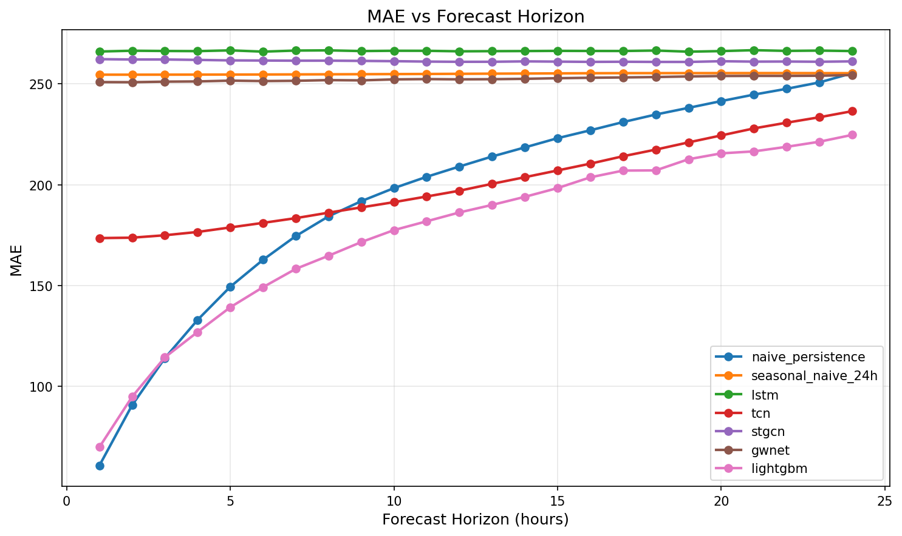

**RMSE‑H 曲线（所有基线）：**  


**训练曲线与样例预测（基线）：**  
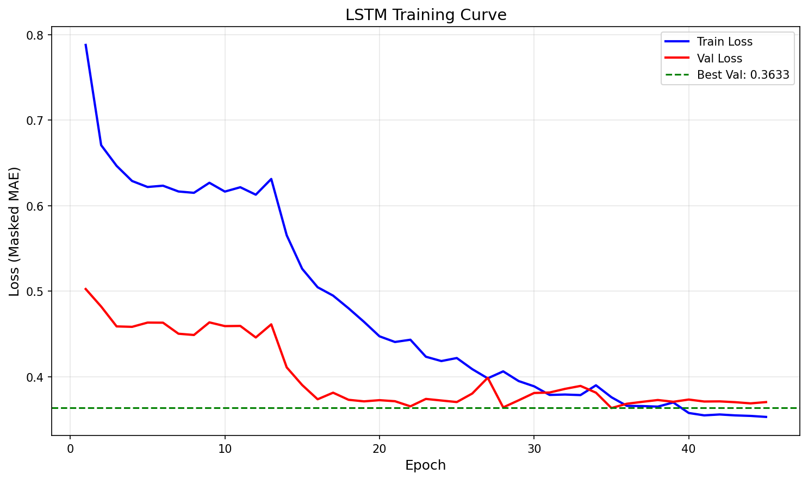
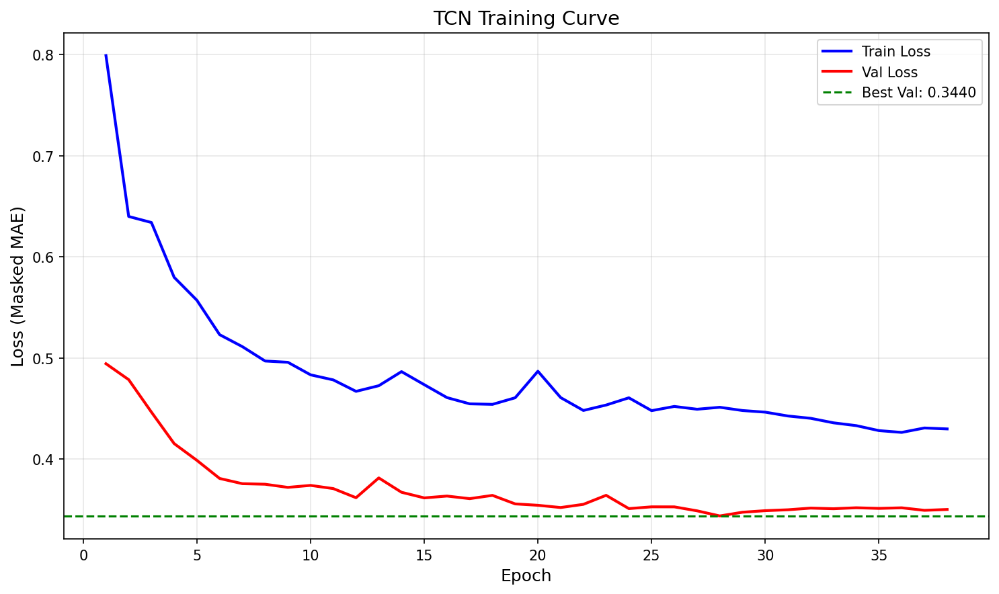
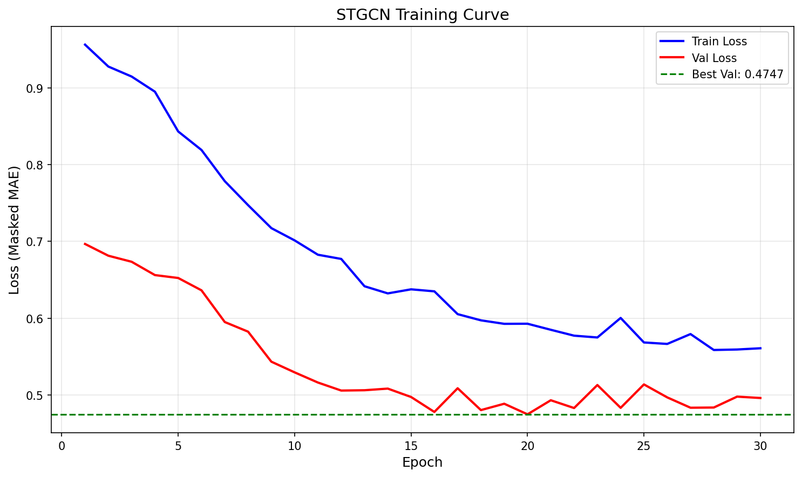
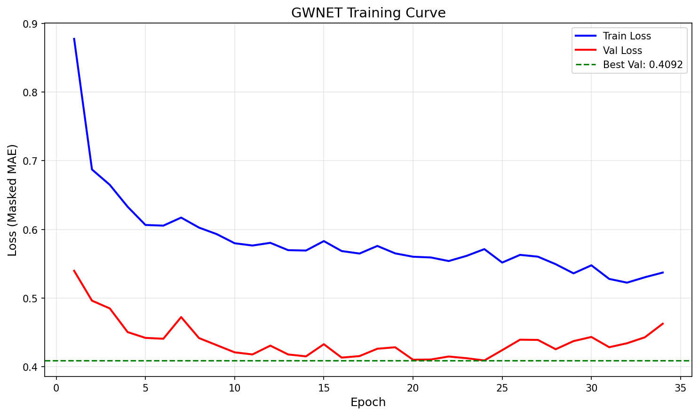
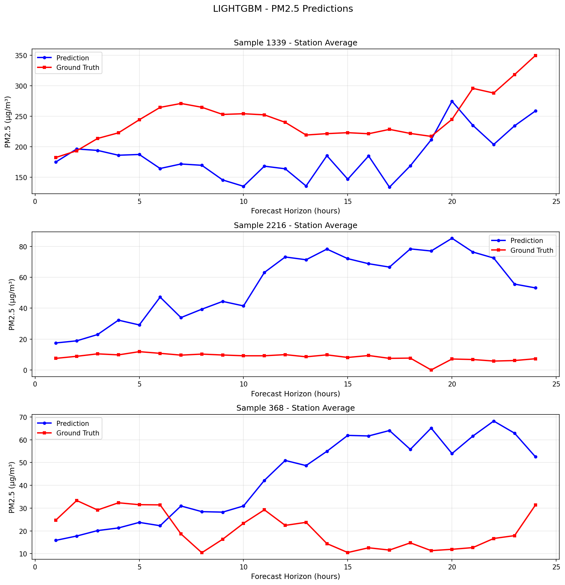
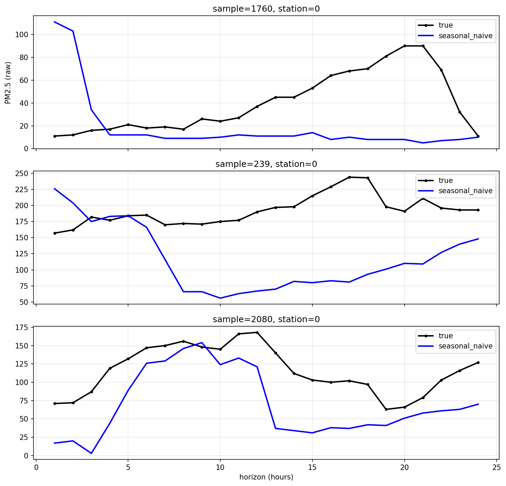

### 7.2 WG-DGTM 模型表现

WG-DGTM 的评估结果保存在 `model/results/**/metrics/` 目录：
- 原始版本：`model/results/metrics/macro_avg_metrics.csv`
- 升级版（residual+multihead）：`model/results/wgdgtm_residual_multihead/metrics/macro_avg_metrics.csv`

#### 7.2.1 宏平均指标对比

| 模型版本 | macro_MAE ↓ | macro_RMSE ↓ | macro_sMAPE(%) ↓ |
|---|---:|---:|---:|
| WG-DGTM | 179.533 | 269.082 | 29.422 |
| WG-DGTM (residual+multihead) | 184.897 | 278.924 | 30.026 |

**关键发现**：原始版本的 WG-DGTM 在宏平均 MAE 上达到 **179.533**,**优于最佳基线 LightGBM 的 182.237**。

为了理解不同预测时刻的表现,我们进一步查看关键时刻（h=1, 6, 12, 24）的宏平均 MAE：

| 模型 | macro_MAE ↓ | h=1 ↓ | h=6 ↓ | h=12 ↓ | h=24 ↓ |
|---|---:|---:|---:|---:|---:|
| lightgbm（最佳基线） | 182.237 | 87.819 | 156.200 | 189.895 | 227.379 |
| WG-DGTM | 179.533 | 132.354 | 155.645 | 182.838 | 216.645 |
| residual+multihead | 184.897 | 67.734 | 155.974 | 193.889 | 237.722 |

**分析**：
- **原始 WG-DGTM**：在中长期（h=6 到 h=24）都优于 LightGBM,整体宏平均最优
- **Residual+multihead 版本**：短期（h=1）表现非常出色（67.7 vs LightGBM 的 87.8）,但长期（h=24）性能下降。这是残差学习的典型权衡——它擅长学习小幅度的短期变化,但在长期趋势预测上可能不如直接预测

#### 7.2.2 各污染物的详细表现

WG-DGTM 在每种污染物上的 MAE（单位：μg/m³）：

| 污染物 | WG-DGTM MAE |
|---|---:|
| PM2.5 | 52.279 |
| PM10 | 60.752 |
| SO2 | 9.187 |
| NO2 | 23.023 |
| CO | 916.276 |
| O3 | 15.678 |

**与 LightGBM 对比**（全部 6 种污染物都有提升）：

| 污染物 | LightGBM | WG-DGTM | 改善幅度 |
|---|---:|---:|---:|
| PM2.5 | 56.505 | 52.279 | **-4.226** |
| PM10 | 65.302 | 60.752 | **-4.550** |
| SO2 | 9.411 | 9.187 | **-0.224** |
| NO2 | 23.949 | 23.023 | **-0.926** |
| CO | 922.082 | 916.276 | **-5.806** |
| O3 | 16.171 | 15.678 | **-0.493** |

**与各污染物的最优基线对比**：

有趣的是,不同污染物的最优基线并不相同。PM2.5、PM10 和 SO2 的最优基线是 TCN,而 NO2、CO 和 O3 的最优基线是 LightGBM。这反映了不同污染物的时间动态特性不同。

即使与各自的最优基线相比,WG-DGTM 仍然在所有污染物上都实现了提升：

| 污染物 | 最优基线模型 | 最优基线 MAE | WG-DGTM MAE | 改善幅度 |
|---|---|---:|---:|---:|
| PM2.5 | TCN | 52.795 | 52.279 | **-0.515** |
| PM10 | TCN | 61.877 | 60.752 | **-1.124** |
| SO2 | TCN | 9.305 | 9.187 | **-0.118** |
| NO2 | LightGBM | 23.949 | 23.023 | **-0.926** |
| CO | LightGBM | 922.082 | 916.276 | **-5.806** |
| O3 | LightGBM | 16.171 | 15.678 | **-0.493** |

三模型对比（LightGBM / TCN / WG‑DGTM，按污染物 MAE）：

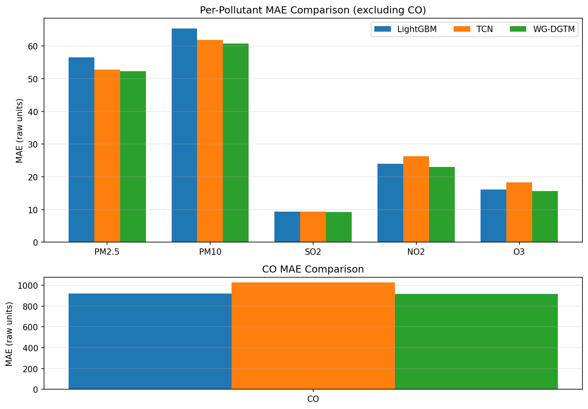

#### 7.2.3 必要图表：误差曲线、样例预测、训练曲线

原始 WG‑DGTM：

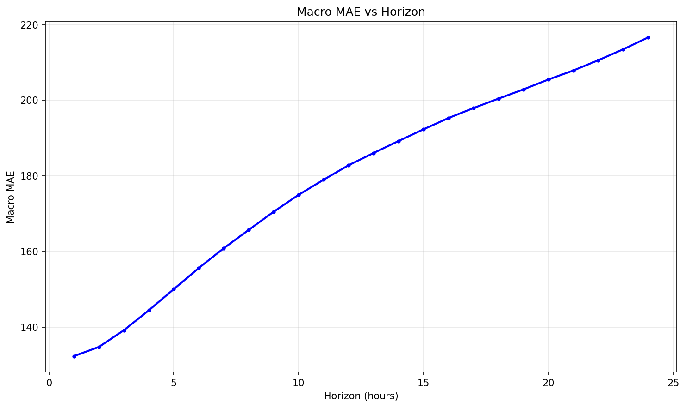
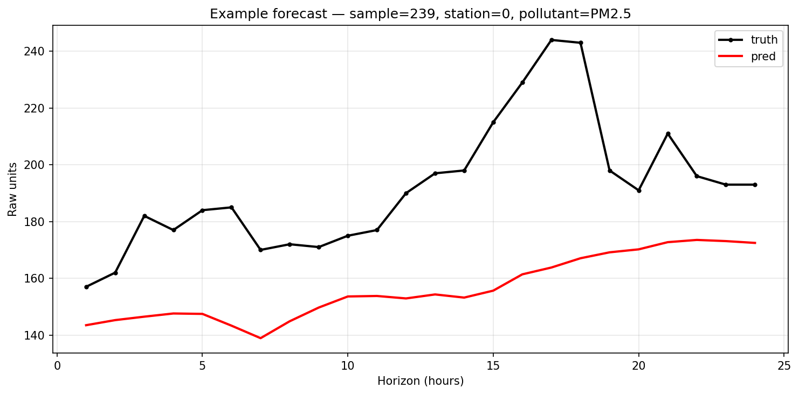
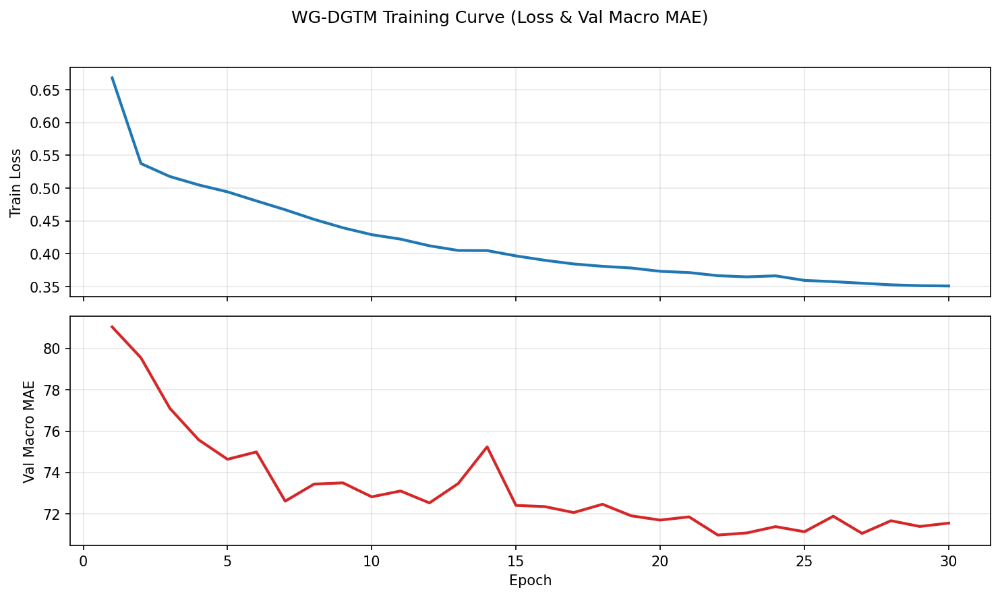

residual+multihead：

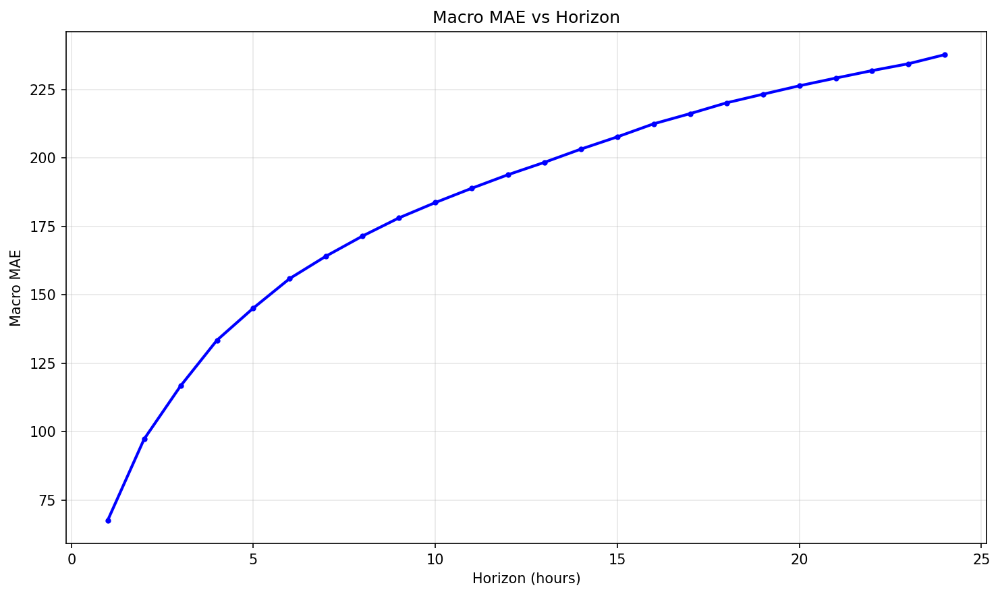
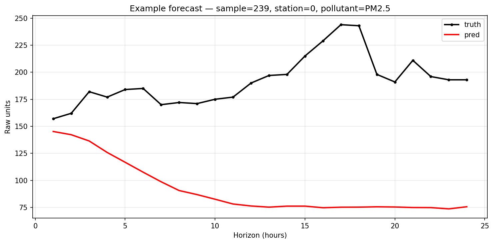
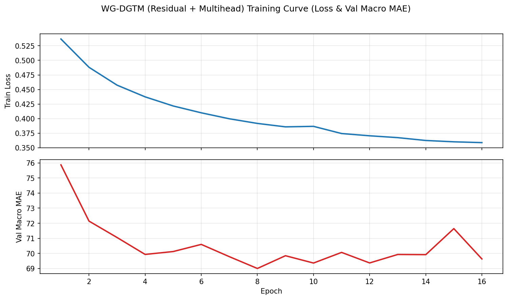

#### 7.2.4 验证集训练过程（用于可复核的“结果来源”说明）

训练历史保存在：
- `model/results/logs/train_history.csv`
- `model/results/wgdgtm_residual_multihead/logs/train_history.csv`

其最优验证集 macro_MAE（越低越好）为：
- WG‑DGTM：70.979（epoch 22）
- residual+multihead：69.004（epoch 8）

> 注：验证集最优并不保证测试集最优；本快照中 residual+multihead 在 val 上更优，但在 test 的中长步误差更大（见 7.2.1）。

### 7.3 特殊情况分析

为了更全面地评估模型的鲁棒性和泛化能力,我们补充了两类特殊情况下的性能测试：节假日/周末场景和数据缺失场景。

#### 7.3.1 节假日与周末表现

节假日和周末的空气质量变化模式与工作日存在显著差异,主要体现在交通流量、工业活动和供暖需求的变化上。为了评估模型在这些非常规时段的预测能力,我们将测试集样本按照预测时刻是否落在节假日或周末进行分组,分别计算宏平均 MAE。

**不同时段的预测误差对比**：

| 时段 | LightGBM macro_MAE ↓ | WG‑DGTM macro_MAE ↓ |
|---|---:|---:|
| 节假日 | 252.873 | 284.985 |
| 非节假日 | 175.208 | 169.435 |
| 周末 | 182.076 | 186.199 |
| 工作日 | 182.319 | 177.330 |

**误差随预测步变化**（节假日 vs 非节假日）：

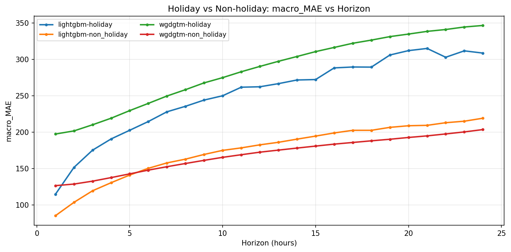

从结果可以看出：
- **节假日预测难度显著增加**：两个模型在节假日窗口上的误差都大幅上升（相比非节假日增加约 40-60%）。这可能源于两方面原因：（1）节假日期间排放模式的变化（如交通流减少、居民活动增加）；（2）节假日主要集中在冬季,与季节性污染加重产生混合效应。
- **模型表现差异**：WG‑DGTM 在非节假日场景下显著优于 LightGBM（169.4 vs 175.2）,但在节假日场景下表现不如 LightGBM（285.0 vs 252.9）。这提示深度学习模型可能对训练集中相对稀少的节假日样本学习不足。
- **周末效应较温和**：周末与工作日的误差差异远小于节假日与非节假日,说明周末的排放模式变化相对规律,模型能够较好地适应。

#### 7.3.2 数据缺失鲁棒性测试

实际应用中,监测站点可能因设备故障、校准维护等原因出现临时性数据缺失。为了评估模型在输入数据不完整情况下的表现,我们在测试集上人为引入额外的随机缺失,并在不重新训练的情况下直接评估模型性能。具体做法是：在测试集输入的污染物观测值中,随机抹除一定比例的原本可用的数据点（缺失率分别设为 10%、30%、50%）,用标准化后的中位数（即 0）代替。

**不同缺失率下的宏平均 MAE**：

| 额外缺失率 | naive_persistence | TCN | LSTM | WG‑DGTM |
|---:|---:|---:|---:|---:|
| 0%（原始） | 197.094 | 198.908 | 229.522 | **179.855** |
| 10% | 203.397 | 201.573 | 228.691 | **183.158** |
| 30% | 216.375 | 208.279 | 225.140 | **192.257** |
| 50% | 229.110 | 215.975 | 218.113 | **203.884** |

**误差随缺失率变化趋势**：

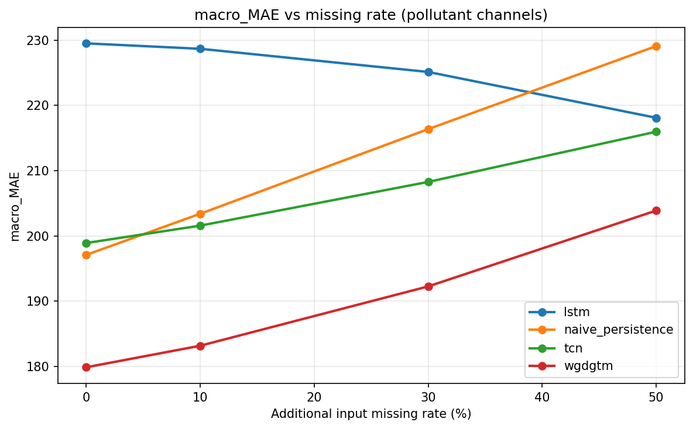

主要发现：
- **WG‑DGTM 保持相对优势**：即使在 50% 额外缺失率的极端情况下,WG‑DGTM 的误差（203.9）仍优于其他模型,说明其时空图结构能够从邻近站点和历史趋势中有效补偿缺失信息。
- **不同模型的退化速度差异明显**：
  - Naive Persistence 退化最快（197.1 → 229.1,增加 16.2%）,因为它完全依赖最后时刻的观测值,缺失直接导致预测基准失效。
  - TCN 表现出良好的鲁棒性（198.9 → 216.0,仅增加 8.6%）,得益于时间卷积能从较长历史窗口中提取稳健特征。
  - WG‑DGTM 介于两者之间（179.9 → 203.9,增加 13.4%）,虽然绝对误差上升,但相对排名始终保持最优。
- **实际应用启示**：在数据质量不稳定的实际部署场景中,基于时空图的深度学习模型相比简单统计方法具有更强的容错能力。

---

## 8. 总结

**数据特征**：
- 污染物数据的缺失率（1-5%）明显高于气象数据（< 0.1%）
- 所有污染物都呈现长尾分布,CO 的数值量级（均值 1230 μg/m³）远大于其他污染物（几十到一百左右）
- 北京空气污染有明显的季节性（冬高夏低）和日周期（PM2.5 夜高,O3 午高）
- 不同站点既有各自的特点,也存在较强的空间相关性

**方法设计**：
- 预处理流程（v2.1）通过"先划分再处理"、"只用训练集统计量"、"严格的窗口生成"等措施,彻底避免了数据泄露
- 掩码机制（`Y_mask`）确保缺失值不会影响模型训练和评估的准确性
- 标准差加权的损失函数解决了 CO 主导梯度的问题,让模型能够平衡地学习所有污染物

**实验结果**：
- 在 7 个基线模型中,**LightGBM 表现最好**（macro_MAE = 182.237）
- 自定义的 **WG-DGTM 进一步提升了性能**（macro_MAE = 179.533）,并且在**全部 6 种污染物上都超过了各自的最优基线**
- 这验证了"风门控动态图 + TCN"的设计是有效的：动态图能够根据风场调整站点之间的影响,TCN 能够高效地捕捉长时间依赖
- Residual+multihead 升级版在短期预测（h=1）上表现出色,但牺牲了长期性能,这提示可以通过调整损失函数（比如给不同预测时刻不同权重）来平衡短期和长期表现
