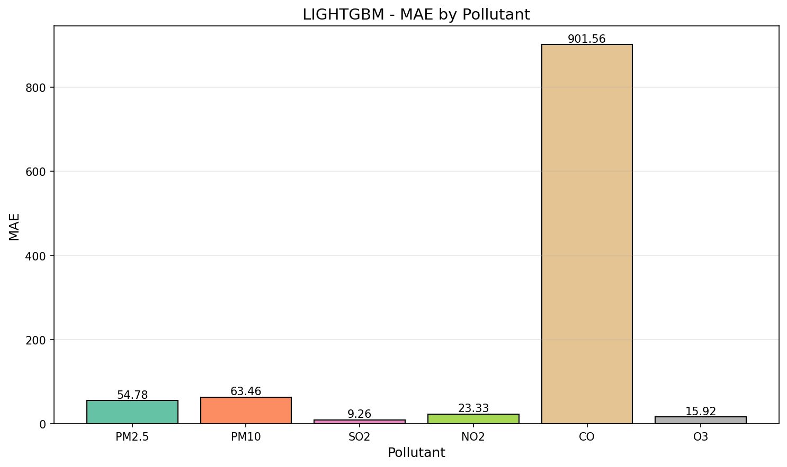
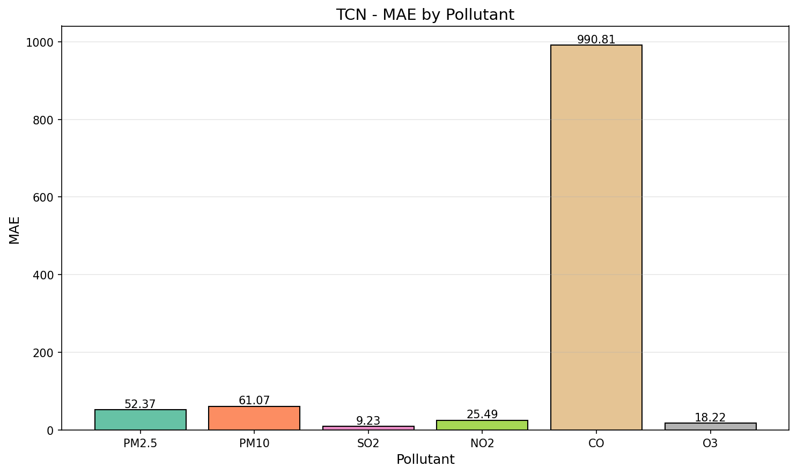
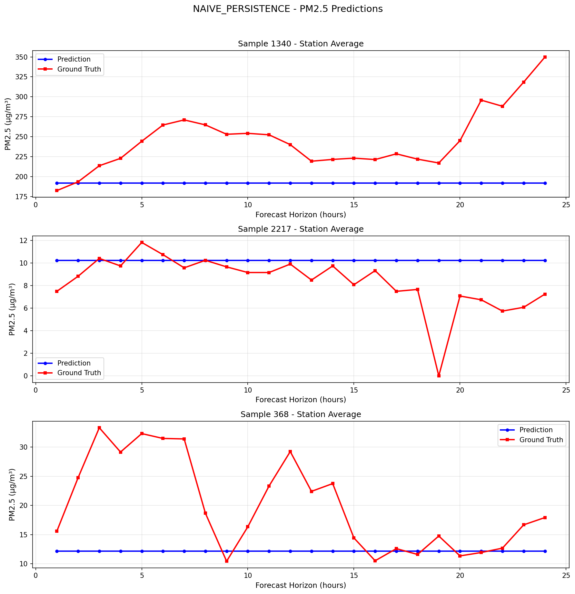

# PRSA 北京多站点空气质量预测：基线套件与多 GPU 复现实验报告（v2.1）

## 摘要

本报告面向 UCI PRSA Beijing Multi‑Site Air Quality（2013–2017）数据集，给出从探索性数据分析（EDA）、无泄露预处理（v2.1）、到基线模型套件训练与评估的完整复现实验流程，并重点记录“指定 GPU 仍会占用全部 GPU”的排查与修复方案。任务定义为：使用过去 7 天（`L=168` 小时）的多站点观测，预测未来 24 小时（`H=24`）12 个站点、6 类污染物（`D=6`）的浓度。所有评估指标均在 TEST 集上、按 `Y_mask` 进行缺失屏蔽计算，并自动生成可视化图表以便复核。

---

## 1. 任务定义与数据集概况

### 1.1 固定任务参数

| 参数 | 含义 | 取值 |
|---|---|---:|
| `N` | 站点数 | 12 |
| `L` | 输入窗口 | 168 小时 |
| `H` | 预测步长 | 24 小时 |
| `D` | 预测目标维度 | 6（污染物） |
| `F` | 输入特征维度 | 17 |

数据产物与配置可在 `processed/metadata.json`、`processed/feature_list.json`、`processed/target_list.json` 中复核。

### 1.2 变量与站点

- 站点：北京 12 个监测站（按字母序对齐）：Aotizhongxin, Changping, Dingling, Dongsi, Guanyuan, Gucheng, Huairou, Nongzhanguan, Shunyi, Tiantan, Wanliu, Wanshouxigong。
- 污染物（6）：PM2.5、PM10、SO2、NO2、CO、O3。
- 气象（5）：TEMP、PRES、DEWP、RAIN、WSPM。
- 其他（6）：风向 sin/cos（2）与时间周期编码（小时/月份 sin/cos，4）。

### 1.3 EDA 关键图表（必要可视化）

EDA 由 `eda_beijing_air_quality.py` 生成，图表位于 `eda_output/`。

**缺失模式与分布：**  


**分布与季节性：**  


**站点对比：**  


**相关性矩阵（示例：PM2.5 驱动站点相关）：**  


---

## 2. 预处理流程（v2.1，严格防泄露）

预处理脚本为 `preprocessing_pipeline_v2.1.py`，输出至 `processed/`，并在 `processed/README.md` 给出关键约定（尤其是 `Y_mask` 的必要性）。

### 2.1 核心设计原则

1. **先切分后处理**：按时间边界切分 train/val/test 后，再在各自分割内进行插补与特征构造，避免未来信息渗入。
2. **缩放仅在 TRAIN 拟合**：RobustScaler 参数仅由 TRAIN 拟合，应用到 val/test。
3. **图构建仅使用 TRAIN**：图结构（站点相关）由 TRAIN 统计量构建，避免测试信息泄露。
4. **窗口不跨边界**：监督窗口生成不跨越 split 边界。

### 2.2 关键张量形状与缺失处理约定

- 深度学习管线（`processed/P1_deep/*.npz`）：
  - `X`：`(samples, 168, 12, 17)`（**已缩放**）
  - `Y`：`(samples, 24, 12, 6)`（**原始单位**；缺失位置以 0 存储）
  - `X_mask / Y_mask`：同形状二值掩码（1=观测，0=缺失）
- 简单基线管线（`processed/P2_simple/*.npz`）：
  - 同样提供 `Y_mask`（v2.1 修复项），用于避免缺失位置的指标污染。

> 注意：由于 `Y` 的缺失以 0 存储，任何训练/评估都必须显式使用 `Y_mask` 进行屏蔽，否则 MAE/RMSE 会被系统性低估或高估。

---

## 3. 基线模型套件与训练/评估协议

### 3.1 基线模型列表（B0–B6）

| 编号 | 模型 | 备注 |
|---:|---|---|
| B0 | Naive Persistence | `y(t+h)=y(t)` |
| B1 | Seasonal Naive 24h | `y(t+h)=y(t+h-24)` |
| B2 | LightGBM | 严格因果滞后 + 滚动统计 + 站点类别特征 |
| B3 | LSTM（Direct Multi‑Horizon） | 时间序列端到端多步预测 |
| B4 | TCN | 时序卷积网络 |
| B5 | STGCN（固定图） | 使用 `processed/graphs/adjacency_corr_topk.npy` |
| B6 | Graph WaveNet（自适应图） | 可学习图结构 + 时序卷积 |

### 3.2 训练细节（PyTorch 模型）

- 优化器：Adam（默认 `weight_decay=0`）。
- 学习率调度：`ReduceLROnPlateau(factor=0.5, patience=5)`。
- 早停：验证集损失在 `patience` 轮内无改进则停止（详见 `baseline/training/early_stopping.py`）。
- 梯度裁剪：`max_norm=5.0`。
- **目标归一化（仅用于损失）**：当 `processed/metadata.json` 中 `scale_targets=false` 时，为缓解不同污染物量纲差异（尤其 CO）对训练损失的主导影响，训练阶段可对 `Y` 进行按污染物的 robust center/scale 归一化；评估仍在原始单位进行（详见 `baseline/training/trainer_torch.py` 与 `baseline/scripts/run.py` 中 `_fit_target_normalizer`）。

### 3.3 指标定义（全部为 Masked 版本）

评估由 `baseline/evaluation/evaluate.py` 统一执行，核心指标定义（`m` 为掩码，1=有效、0=缺失）：

- MAE：\n  `MAE = sum(|ŷ - y| * m) / sum(m)`
- RMSE：\n  `RMSE = sqrt( sum((ŷ - y)^2 * m) / sum(m) )`
- sMAPE（百分比）：\n  `sMAPE = 100 * mean( |ŷ - y| / (|ŷ| + |y| + eps) )`（仅在 `m=1` 位置取均值）

同时输出：
- **按预测步长**（h=1..24）的指标曲线；
- **按污染物**（6 类）的指标柱状图；
- 若干随机样本的预测可视化（以 PM2.5 为例）。

---

## 4. 计算环境与多 GPU 配置（含问题排查与修复）

### 4.1 软件与硬件环境（dl conda 环境）

以下版本由 `conda run -n dl` 输出复核：

| 组件 | 版本 |
|---|---|
| Python | 3.11.14 |
| PyTorch | 2.8.0+cu128 |
| CUDA（PyTorch 编译） | 12.8 |
| NumPy | 2.2.5 |
| Pandas | 2.3.3 |
| Matplotlib | 3.10.6 |
| scikit‑learn | 1.7.2 |
| LightGBM | 4.6.0 |

GPU（PyTorch 查询）：
- `device_count=4`
- 设备名称：`NVIDIA GeForce RTX 4090 D`（4 张）

### 4.2 “指定 GPU 仍占用全部 GPU”的根因与修复

**问题现象**：运行基线脚本时即使传入 `--gpu/--gpus`，进程仍可能初始化并“看到”所有 GPU，导致资源占用与预期不符。  

**根因机制**：在 PyTorch 中，CUDA 设备可见性通常通过环境变量 `CUDA_VISIBLE_DEVICES` 控制；一旦 `torch` 被导入并触发 CUDA 初始化，再去修改该变量往往不会生效（设备枚举已完成）。

**修复要点（已落地）**：在 `baseline/scripts/run.py` 中将 GPU 选择逻辑前置到 `torch` 导入之前：
1. CLI 解析 `--gpu/--gpus`；
2. 设置/收缩 `CUDA_VISIBLE_DEVICES`；
3. 再导入 `torch` 与其余基线模块；
4. 对于 `DataParallel`，在收缩可见设备后使用可见索引 `[0..k-1]` 作为 `device_ids`，确保多卡训练行为一致。

---

## 5. 可复现实验流程（Procedures）

> 说明：本仓库运行基线需要 `dl` conda 环境。若 `conda` 位于 `/root/miniconda3/bin/conda`，可使用 `conda run` 方式执行而无需交互式 `conda activate`。

### 5.1（可选）EDA

```bash
python eda_beijing_air_quality.py
```

产物：`eda_output/`（含 `eda_report.html` 与多张 PNG）。

### 5.2 预处理（v2.1）

```bash
python preprocessing_pipeline_v2.1.py
```

产物：`processed/`（含 `P1_deep/`、`P2_simple/`、`tabular_lgbm/`、`graphs/`）。

### 5.3 运行全部基线（使用全部 4 张 GPU）

建议先确保没有上游调度器残留的 GPU 可见性限制：

```bash
unset CUDA_VISIBLE_DEVICES
python -m baseline.scripts.run --model all --config baseline/configs/default.yaml
```

或显式指定：

```bash
python -m baseline.scripts.run --model all --config baseline/configs/default.yaml --gpus 0,1,2,3
```

### 5.4 仅运行单个模型/指定 GPU 子集

```bash
python -m baseline.scripts.run --model gwnet --config baseline/configs/gwnet.yaml --gpus 2,3
python -m baseline.scripts.run --model tcn   --config baseline/configs/tcn.yaml   --gpu 1
```

---

## 6. 实验结果（TEST 集，Masked 指标）

所有结果文件默认输出至 `baseline/results/`。核心汇总文件：
- `baseline/results/model_comparison.csv`：各模型总体指标与关键步长（h=1/6/12/24）MAE 汇总。
- `baseline/results/metrics_overall.csv`：含 macro 平均（按污染物等权）的总体指标。
- `baseline/results/metrics_per_pollutant.csv`：按污染物分解的总体与关键步长 MAE。

### 6.1 总体对比（来自 `baseline/results/model_comparison.csv`）

> 表中数值为文件中的原始输出做四舍五入展示；以 CSV 为准。

| 模型 | MAE ↓ | RMSE ↓ | sMAPE(%) ↓ | MAE@h1 ↓ | MAE@h6 ↓ | MAE@h12 ↓ | MAE@h24 ↓ |
|---|---:|---:|---:|---:|---:|---:|---:|
| lightgbm | 180.994 | 550.906 | 30.18 | 87.205 | 155.131 | 188.603 | 225.830 |
| naive_persistence | 195.757 | 619.812 | 32.09 | 60.819 | 162.775 | 208.991 | 255.227 |
| tcn | 197.514 | 641.416 | 31.73 | 158.952 | 173.278 | 197.184 | 235.474 |
| lstm | 227.942 | 767.073 | 36.51 | 209.124 | 216.625 | 228.896 | 245.183 |
| gwnet | 249.602 | 788.987 | 39.48 | 246.335 | 247.532 | 249.442 | 252.665 |
| seasonal_naive_24h | 254.928 | 747.602 | 39.49 | 254.494 | 254.583 | 254.923 | 255.227 |
| stgcn | 333.515 | 1030.602 | 46.92 | 333.646 | 333.867 | 333.394 | 333.377 |

**MAE‑H 曲线（所有模型）：**  


**RMSE‑H 曲线（所有模型）：**  


### 6.2 按污染物的最优模型（MAE，来自 `baseline/results/metrics_per_pollutant.csv`）

| 污染物 | 最优模型（MAE 最小） | MAE |
|---|---|---:|
| PM2.5 | tcn | 52.795 |
| PM10 | tcn | 61.877 |
| SO2 | tcn | 9.305 |
| NO2 | lightgbm | 23.949 |
| CO | lightgbm | 922.082 |
| O3 | lightgbm | 16.171 |

对应的按污染物柱状图示例（模型内自动生成）：

**LightGBM：**  


**TCN：**  


### 6.3 训练曲线与样例预测（必要可视化）

**训练损失曲线：LSTM / TCN / STGCN / GWNet**  


**样例预测（PM2.5，随机样本）：LightGBM vs Naive**  



**季节性朴素基线的 sanity check：**  


---

## 7. 讨论（基于可观测结果的解释）

1. **总体最优为 LightGBM**：在聚合指标（MAE/RMSE/sMAPE）上均为最优，且在 CO/NO2/O3 三类污染物上取得最低 MAE，显示出基于严格因果滞后/滚动统计的表格模型在中长期预测上的优势。
2. **TCN 在 PM2.5/PM10/SO2 上最优**：按污染物 MAE 最小结果表明，纯时序卷积对颗粒物与 SO2 预测更具优势，但其总体聚合 MAE 仍略逊于 naive persistence（提示不同污染物量纲与误差贡献的不均衡，尤其 CO 的影响较大）。
3. **短期（h=1）朴素持久性较强**：`naive_persistence` 在 h=1 的总体 MAE 最低，符合空气质量短时惯性特征；同时也提示在 `H=24` 的多步设定下，模型是否真正提升需结合步长曲线综合判断。

---

## 8. 输出文件与复核清单

### 8.1 结果表格

- `baseline/results/model_comparison.csv`
- `baseline/results/metrics_overall.csv`
- `baseline/results/metrics_per_pollutant.csv`
- `baseline/results/metrics_summary.csv`（更细粒度：按 horizon 与 pollutant）

### 8.2 图表目录

- `baseline/results/plots/`：各模型 MAE‑H 曲线、按污染物柱状图、训练曲线、样例预测等。
- `eda_output/`：EDA 图表与 `eda_report.html`。

---

## 9. 结论

在 v2.1 预处理与严格 Masked 评估协议下，基线套件的结果表明：LightGBM 在总体指标上最优，并在 CO/NO2/O3 上显著占优；TCN 在 PM2.5/PM10/SO2 上最优，体现出不同模型对不同污染物的适配差异。针对多 GPU 选择不生效的问题，本仓库已将 `CUDA_VISIBLE_DEVICES` 的设置前置到 `torch` 导入之前，确保 `--gpu/--gpus` 参数能够可靠控制可见 GPU 并与 `DataParallel` 的 `device_ids` 一致。

